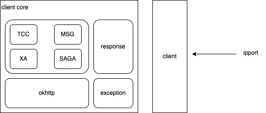
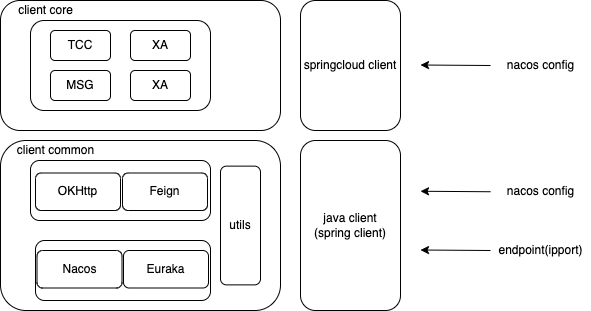

# new version
新版本相比于旧版本Java client的的改造
## 旧版本客户端

### 旧版本在设计上可以改进的一些地方
1.引入的类从引入路径看不出来自哪个jar包，比如exception.FailureException。在大型项目中可能会出现多个相同的类名，如果不明确包名可能会导致意义混乱，甚至引入冲突。
2.tcc等类直接依赖了dtmsvr信息，这样的依赖方式对后期的维护不友好，如果修改了DtmServerInfo的属性，那么后期需要修改所有支持的方式。应该做一个客户端这样的东西专门用来发送请求。
3.向dtmsvr传递参数时使用了map来传递，虽然这对用户是无感知的，但是客户在debug的时候使用map比较麻烦，感觉使用一个param对象比较好
## 新版本客户端

### 新版本中改进的地方
1.由于新版本需要同时支持http和feign两种交互方式，因此将请求dtmsvr相关的部分以及整个client的公共部分抽取出来形成了dtmcli-common模块，这样后续如果需要支持更多的交互方式只需要改动dtmcli-common中的代码，并在core新增代码
2.springcloud版本的client不在乎需要传入ipport这样的配置参数，一切通过feign+nacos/euraka集成起来处理。因此将java-client和spring-client分开处理了
3.对于一些非springcloud的项目我们也提供了java-client来处理，java-client支持像以前那样直接配置endpoint的方式，同时为了适配frontend服务，也支持通过配置nacos服务中心地址这样的方式来动态查找dtmsvr具体的地址。
4.优化了整个项目的包结构，让引入dtmcli-java的时候能够快速找到来自哪个包

